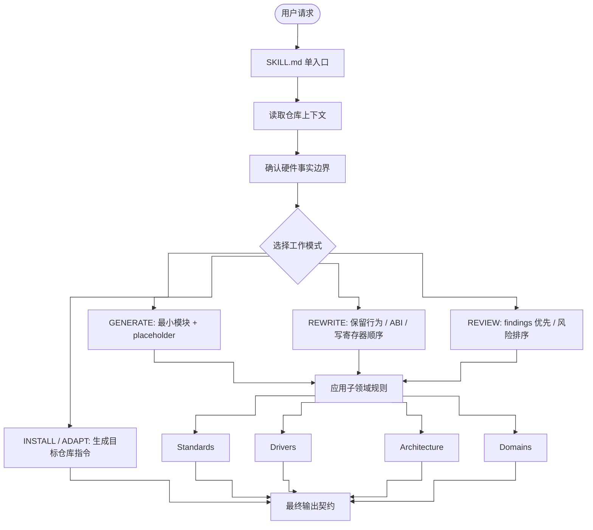

# embedded-code-skill

<p align="center">
  
  
  
  
  
  
</p>

> 嵌入式 C 代码助手，用于写驱动骨架、整理旧代码、审查低层固件，并把同一套规则适配到不同 IDE 或 agent 环境。

[简体中文](README.md) · [English](README_EN.md) · [日本語](README_JP.md)

---

## 这个仓库是什么

这个仓库现在只有一个规则入口：`SKILL.md`。

`SKILL.md` 已经综合了原来的核心 skill、子领域规则、IDE 适配规则和参考说明。它帮助模型在下面这些任务中保持稳定、保守、可审查的输出：

- 写新的嵌入式 C 驱动骨架
- 整理旧的驱动、HAL/BSP 或寄存器访问代码
- 审查 ISR、DMA、cache、volatile、竞态、timeout、overflow 等低层风险
- 按目标仓库已有约定适配 status type、命名、vendor SDK、build macros
- 把同一套规则提取成 Cursor、VS Code、Claude-compatible agents 或 `AGENTS.md` 可用的指令

它**不是**芯片厂商参考手册，也不会替代真实寄存器表、IRQ、屏障、cache/DMA 规则、时序要求或认证资料。

---

## 快速开始

```bash
/embedded-code-skill 生成一个 STM32 UART 驱动，基地址 0x4000C000
/embedded-code-skill 整理这段 SPI 初始化代码，并保留寄存器写入顺序
/embedded-code-skill 审查这段 DMA ISR 是否有竞态、volatile 或 cache 问题
/embedded-code-skill 生成一份 Cursor .cursor/rules/*.mdc 规则内容
```

---

## 工作模式

| 模式 | 用途 |
|------|------|
| `GENERATE` | 写新的最小可维护模块，缺硬件事实时标注 placeholder |
| `REWRITE` | 整理旧代码，保留外部行为、ABI、寄存器写入顺序和时序敏感序列 |
| `REVIEW` | finding 优先，先看 correctness、硬件行为、竞态和可移植风险 |
| `INSTALL` / `ADAPT` | 把 `SKILL.md` 规则转成目标 IDE 或 agent 的指令文件 |

---

## Skill 架构

`SKILL.md` 是单入口文件，里面不是简单堆规则，而是按“请求识别 -> 仓库上下文 -> 工作模式 -> 子领域规则 -> 输出契约”的顺序组织。



---

## 功能矩阵

| 层级 | 覆盖内容 |
|------|----------|
| 入口层 | 单一 `SKILL.md`，包含 frontmatter、定位、触发范围和使用原则 |
| 上下文层 | 读取本地头文件、宏、status type、命名、SDK、编译开关、已有驱动 |
| 事实边界 | 缺少资料时标注 `USER_PROVIDED`、`REPO_DERIVED`、`PLACEHOLDER`，不猜硬件细节 |
| 工作模式 | `GENERATE`、`REWRITE`、`REVIEW`、`INSTALL`、`ADAPT` |
| 输出契约 | 生成代码、重写代码、review findings、IDE 指令分别有固定结构 |
| 编码规范 | 命名、类型、错误处理、结构体模式、注释、动态内存限制 |
| 驱动模板 | UART、SPI、I2C、DMA、CAN、GPIO、Timer、Watchdog、MIL-STD-1553 |
| 架构规则 | Cortex-M、Cortex-A、PowerPC、SPARC V8、RISC-V、未知架构处理 |
| 行业领域 | 航空、军工、工业安全、汽车功能安全、General Embedded |
| 回查清单 | 硬件常量来源、寄存器访问、并发安全、行为保留、IDE 适配冲突 |
| 维护自检 | 修改 skill 后用 generate、rewrite、review、adapt、领域场景做人工 smoke check |

---

## 核心规则

| 类别 | 规则 |
|------|------|
| 仓库优先 | 先沿用已有 status type、命名、SDK、include 顺序和 build macros |
| 硬件事实 | 不编造寄存器偏移、位定义、reset 值、IRQ、屏障或时序要求 |
| 输出契约 | 生成、重写、审查分别有固定输出顺序，便于 IDE 应用 |
| 类型 | 公共接口优先使用固定宽度整数和 `bool` |
| 错误处理 | 项目无约定时使用 `embedded_code_status_t` |
| 寄存器抽象 | 使用独立寄存器定义或复用 vendor/CMSIS 结构 |
| 内存 | 低层驱动默认不使用动态分配或 VLA |
| 并发安全 | ISR、DMA、cache、critical section 和 memory ordering 必须保守处理 |

---

## 子领域覆盖

`SKILL.md` 里已经内置下面四类子领域规则，不再拆成单独目录。

### Standards

- 命名、指针命名、固定宽度类型、`bool`
- fallback status type：`embedded_code_status_t`
- 配置结构体、运行时句柄、状态枚举的组织方式
- magic number、buffer size、timeout、retry count、注释和 review checklist

### Drivers

- 统一结构：`*_reg.h`、`*_reg_t`、`*_REG`、`MASK/SHIFT`
- 覆盖 UART、SPI、I2C、DMA、CAN、GPIO、Timer、Watchdog、MIL-STD-1553
- 包含最小寄存器字段参考、常用位命名示例、GPIO mode、MIL-STD-1553 mode/message 类型
- 明确这些模板只说明组织方式，真实 offset、reserved bit、reset 值和 errata 必须来自目标资料

### Architecture

- 覆盖 ISR、barrier、DMA、cache、interrupt controller、SMP、memory ordering、CSR/SPR
- 包含 Cortex-M、Cortex-A、PowerPC、SPARC V8、RISC-V quick ref
- 包含 PowerPC / SPARC / RISC-V wrapper 示例
- 未知架构时要求资料来源；不能确认时只生成架构无关骨架并标注 placeholder

| 架构 | 中断/控制器 | 屏障/同步 | 特殊寄存器 |
|------|-------------|-----------|------------|
| Cortex-M | NVIC | `__DMB()`, `__DSB()`, `__ISB()` | N/A |
| Cortex-A | GIC | `dmb ish` | system registers |
| PowerPC | PIC | `msync` | `mfspr` |
| SPARC V8 | INTC | `stbar` | `rd psr` |
| RISC-V | PLIC/CLINT | `fence` | `csrr` |

### Domains

- 覆盖 Aerospace / DO-178C、Military / MIL-STD、Industrial / IEC 61508、Automotive / ISO 26262
- 包含关键词识别、关注点、默认要求和安全审查重点
- 不把 DAL、ASIL、SIL、MC/DC、SPFM、LFM、BIT 覆盖率当成通用默认值

---

## 适配到 IDE 或 Agent

以 `SKILL.md` 为唯一来源，再按目标工具需要提取核心规则：

下面这些路径是**目标仓库中的生成位置**，不是本仓库自带文件。

- Cursor：`.cursor/rules/*.mdc`
- VS Code / Copilot：`.github/copilot-instructions.md`
- VS Code scoped instructions：`.github/instructions/*.instructions.md`
- Claude-compatible agents：`CLAUDE.md`
- 通用 agent：`AGENTS.md`

同一个目标仓库里优先启用一份 always-on 指令，避免重复规则互相叠加。

---

## 包结构

```text
embedded-code-skill/
├── SKILL.md
├── README.md
├── README_EN.md
└── README_JP.md
```

---

## 许可

MIT License
