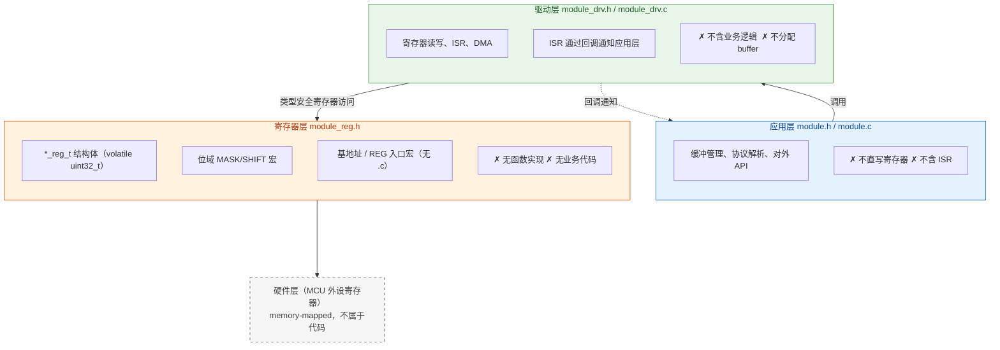

# embedded-code-skill

<p align="center">
  
  
  
  
  
</p>

> 嵌入式 C 的 REWRITE/REVIEW/GUIDE：三层整理、低层审查、RTOS/构建咨询。硬件参数须有出处。

[简体中文](README.md) · [English](README_EN.md) · [日本語](README_JP.md)

---

## 做什么

- **REWRITE**：整理旧驱动代码，保留寄存器写入顺序和时序；按三层架构标准化命名与文件组织
- **REVIEW**：审查 ISR/DMA/cache/竞态风险，按 P0/P1/P2 优先级输出问题表
- **GUIDE**：RTOS 任务设计、CMake 配置、调试策略等咨询（不走 REVIEW 表）

**不是芯片手册**，不替代寄存器手册、IRQ 表或认证资料。
寄存器偏移、位定义、IRQ、屏障、cache/DMA、时序等须来自手册、厂商头文件或仓库。

---

## 核心原则：三层解耦


```mermaid
flowchart TB
    subgraph APP["应用层  module.h / module.c"]
        direction TB
        A1["缓冲管理、协议解析、对外 API"]
        A_ban["✗ 不直写寄存器  ✗ 不含 ISR"]
    end

    subgraph DRV["驱动层  module_drv.h / module_drv.c"]
        direction TB
        D1["寄存器读写、ISR、DMA"]
        D2["ISR 通过回调通知应用层"]
        D_ban["✗ 不含业务逻辑  ✗ 不分配 buffer"]
    end

    subgraph REG["寄存器层  module_reg.h"]
        direction TB
        R1["*_reg_t 结构体（volatile uint32_t）"]
        R2["位域 MASK/SHIFT 宏"]
        R3["基地址 / REG 入口宏（无 .c）"]
        R_ban["✗ 无函数实现  ✗ 无业务代码"]
    end

    HW["硬件层（MCU 外设寄存器）<br/>memory-mapped，不属于代码"]

    APP -->|调用| DRV
    DRV -.->|回调通知| APP
    DRV -->|类型安全寄存器访问| REG
    REG ----> HW

    style APP fill:#e3f2fd,stroke:#1565c0,color:#0d47a1
    style DRV fill:#e8f5e9,stroke:#2e7d32,color:#1b5e20
    style REG fill:#fff3e0,stroke:#e65100,color:#bf360c
    style HW fill:#f5f5f5,stroke:#616161,color:#424242,stroke-dasharray: 5 5
```

**文件布局**：每外设五个文件 —— `module_reg.h` + `module_drv.h/.c` + `module.h/.c`。
平铺项目不建 `module/` 子目录，五文件直接平铺在当前目录。带 `module/` 子目录的项目布局相同，仅多一层目录。

---

## 优先级裁决

规则冲突时从高到低适用：

| 优先级 | 内容 | 让位规则 |
| ------- | ---- | -------- |
| P0 安全红线 | 伪造硬件/写入时序/volatile/ISR 阻塞/可编译/裸寄存器/malloc | 不让位于任何项目约定 |
| P1 并发与可移植 | static 多实例、类型安全、错误处理、宏安全 | 不让位 |
| P1 结构类 | 三层拆分粒度、文件组织 | 项目已有既定架构时让位 |
| P2 风格类 | 命名/注释/include 顺序/文件头 | 一律让位于项目约定 |

---

## RED LINES（P0 安全红线，不让位于任何项目约定）

1. **禁伪造硬件参数**（寄存器/位域/IRQ/屏障/时序/cache/DMA 通道）
2. **禁打乱寄存器写入顺序与时序序列**（REWRITE 必须原样保留）
3. **禁 ISR 与主循环共享变量缺 `volatile`**
4. **禁 ISR 内阻塞调用**（delay/malloc/mutex/printf；RTOS 仅用 ISR 安全 API）
5. **禁不可编译的输出**（类型名/宏名/签名一致，语法正确）
6. **禁业务代码裸寄存器地址**（必须通过寄存器结构体成员访问）
7. **禁驱动层/ISR 使用 `malloc`/VLA**

---

## 快速开始

```bash
# REWRITE：整理 UART 驱动，保留寄存器写入顺序
/embedded-code-skill 整理这段 UART 驱动，按三层架构拆分

# REVIEW：审查 DMA ISR 风险
/embedded-code-skill 审查这段 DMA ISR 是否有竞态或 cache 问题

# GUIDE：RTOS 任务设计
/embedded-code-skill 设计 FreeRTOS 任务优先级和栈大小
```

---

## 安装

```bash
./install.sh          # ~/.claude/skills/embedded-code-skill/
```

---

## 章节导航

| 章节 | 内容 |
|------|------|
| §1 | 定位、使用原则、工作模式、RED LINES |
| §2 | Fallback 编码规范（命名、类型、错误处理、数据结构、注释、枚举、static、宏安全） |
| §3 | 寄存器抽象（分层结构体、MASK/SHIFT、vendor 结构体复用） |
| §4 | 驱动模板（三层五文件、平铺布局、接口规范、关键结构） |
| §5 | 架构规则（Cortex-M RISC-V 屏障/中断/DMA cache 一致性） |
| §6 | RTOS 场景速查（FreeRTOS/Zephyr/RT-Thread ISR 规则、死锁预防） |
| §7 | 构建系统（链接脚本、startup、CMake 模板） |
| §8 | 内存、安全和并发默认值（malloc 禁令、volatile、DMA cache、critical section） |
| §9 | 回查清单与维护自检（P0→P1→P2 逐级检查） |

详细规范请阅读 [SKILL.md](SKILL.md)。

---

## 许可

MIT License
