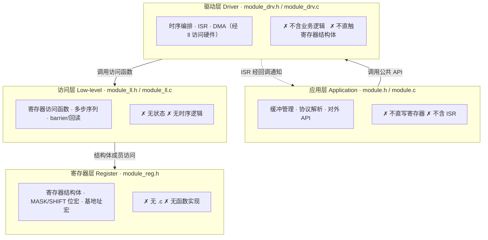

# embedded-code-skill

<p align="center">
  
  
  
  
  
  
</p>

<p align="center">
  <b>AI 编程助手的嵌入式 C 规范助手</b><br/>
  <i>驱动骨架生成 · 旧代码整理 · 代码审查 · 寄存器重构</i>
</p>

<p align="center">
  <a href="README.md">简体中文</a> · <a href="README_EN.md">English</a> · <a href="README_JP.md">日本語</a>
</p>

---

## 这是什么

一个面向 AI 编程助手（Codex / Claude Code / Cursor）的技能文件。把它装进你的 agent 后，AI 在生成、审查、重构嵌入式 C 裸机/驱动代码时，会遵循一套保守、可审查、可编译的编码规范。

| 模式 | 干什么 | 输出 |
|------|--------|------|
| 🔄 **REWRITE** 代码整理 | 整理旧驱动，保留寄存器写入顺序与时序 | 简述 → 缺口清单 → patch |
| 🔍 **REVIEW** 代码审查 | 审查 ISR / DMA / cache / 竞态风险 | P0 / P1 / P2 问题表 |
| 📖 **GUIDE** 设计咨询 | RTOS 任务设计、CMake 配置、调试策略 | 保守建议与示例片段 |

**它不是芯片手册**：寄存器偏移、位定义、IRQ、屏障、cache/DMA、时序一律以手册、厂商头文件或你的仓库为准——AI 不被允许编造硬件事实，信息不足时会标注 `USER_PROVIDED` / `PLACEHOLDER` 并先列出缺口，而不是猜。

---

## 快速开始

```bash
# REWRITE：整理 UART 驱动，保留寄存器写入顺序
/embedded-code-skill 整理这段 UART 驱动，按四层架构拆分

# REVIEW：审查 DMA ISR 风险
/embedded-code-skill 审查这段 DMA ISR 是否有竞态或 cache 问题

# GUIDE：RTOS 任务设计
/embedded-code-skill 设计 FreeRTOS 任务优先级和栈大小
```

REVIEW 模式的输出示例：

| 等级 | 位置 | 问题 | 建议 |
|------|------|------|------|
| P0 | `uart_drv.c:42` | ISR 内调用阻塞函数 | 改用 `...FromISR()` 系列接口 |

> P0 = 行为/安全风险，P1 = 并发/可移植问题，P2 = 风格建议

---

## 核心设计：四层解耦


```mermaid
flowchart TB
    subgraph APP["应用层 Application · module.h / module.c"]
        direction TB
        A1["缓冲管理 · 协议解析 · 对外 API"]
        A2["✗ 不直写寄存器   ✗ 不含 ISR"]
    end
    subgraph DRV["驱动层 Driver · module_drv.h / module_drv.c"]
        direction TB
        D1["时序编排 · ISR · DMA（经 ll 访问硬件）"]
        D2["✗ 不含业务逻辑   ✗ 不直触寄存器结构体"]
    end
    subgraph LL["访问层 Low-level · module_ll.h / module_ll.c"]
        direction TB
        L1["寄存器访问函数 · 多步序列 · barrier/回读"]
        L2["✗ 无状态   ✗ 无时序逻辑"]
    end
    subgraph REG["寄存器层 Register · module_reg.h"]
        direction TB
        R1["寄存器结构体 · MASK/SHIFT 位宏 · 基地址宏"]
        R2["✗ 无 .c   ✗ 无函数实现"]
    end

    APP -->|"调用公共 API"| DRV
    DRV -->|"调用访问函数"| LL
    LL -->|"结构体成员访问"| REG
    DRV -.->|"ISR 经回调通知"| APP
```

每个外设七个文件：`module_reg.h` → `module_ll.h/.c` → `module_drv.h/.c` → `module.h/.c`。平铺项目不建 `module/` 子目录，七文件直接平铺在现有目录，隔离标准不变。**ll/drv 边界**：ll 只管"怎么读写"（无状态），drv 只管"何时读写"（时序 / ISR / DMA）。

**关键规则一览**：

| 规则 | 一句话 |
|------|--------|
| 寄存器结构体化 | 外设寄存器块必须定义为 `*_reg_t` 结构体，禁止散落地址宏 |
| 访问层隔离 | 仅 `_ll.h/.c` 直触寄存器结构体；drv 一律经访问函数操作硬件 |
| const 指针契约 | 输入型指针加 `const`，输出型不加——接口自文档化 |
| Step 编号注释 | 驱动/应用函数体内用 `/* Step N: ... */` 标注关键操作顺序 |
| 枚举优先 | 关联常量集合用 `typedef enum`，位掩码/地址等独立常量用宏 |
| 默认 static | 内部函数与模块私有变量一律 `static`，仅公共 API 对外开放 |
| 拒绝魔数 | 除 `0`/`1` 外字面量必须命名为常量 |
| 自包含头文件 | 每个文件显式包含自身使用的符号，不依赖传递包含 |

---

## RED LINES（P0 安全红线，不让位于任何项目约定）

1. 禁伪造硬件参数（寄存器 / 位域 / IRQ / 屏障 / 时序）
2. 禁打乱寄存器写入顺序与时序序列（REWRITE 必须原样保留）
3. 禁 ISR 与主循环共享变量缺 `volatile`
4. 禁 ISR 内阻塞调用（delay / malloc / mutex / printf）
5. 禁不可编译的输出
6. 禁业务代码裸寄存器地址
7. 禁驱动层 / ISR 使用 `malloc` / VLA

> 规则冲突时的让位顺序：安全红线 → P1 并发与可移植 → P1 结构类（项目已有既定架构时让位）→ P2 风格类（一律让位于项目约定）。

---

## 安装

```bash
git clone https://github.com/leon-2050/embedded-code-skill.git
cd embedded-code-skill

./install.sh          # → ~/.codex/skills/embedded-code-skill/  （默认）
./install.sh cursor   # → ~/.cursor/skills/embedded-code-skill/
./install.sh claude   # → ~/.claude/skills/embedded-code-skill/
```

在仓库目录内执行时，脚本直接使用本地 `SKILL.md`（离线可用、版本与本地一致）；仅在本地文件缺失时才从 `main` 分支下载。也可以手动把 `SKILL.md` 复制到对应平台的 skills 目录。

---

## 章节导航（SKILL.md）

| 章节 | 内容 |
|------|------|
| §1 | 定位、使用原则、工作模式、RED LINES、优先级裁决 |
| §2 | Fallback 编码规范：命名 / 类型与错误处理 / 注释 / include / 枚举 / static / 魔数 / 宏安全 |
| §3 | 寄存器抽象：`*_reg_t` 结构体模板、布局规则、vendor/CMSIS 复用 |
| §4 | 驱动模板：四层七文件、ll/drv 边界、接口模板、关键结构 |
| §5 | 架构规则：Cortex-M / RISC-V / Xtensa 屏障与中断速查、未知架构处理 |
| §6 | RTOS 场景速查（FreeRTOS / Zephyr / RT-Thread） |
| §7 | 构建系统与链接：startup、编译器 attribute、CMake |
| §8 | 内存、安全和并发默认值：malloc 禁令、volatile、DMA cache 一致性 |
| §9 | 回查清单（P0 → P1 → P2）与内容准入 |

全文约 800 行，详细规范请阅读 [SKILL.md](SKILL.md)。

---

## 维护

修改 SKILL.md 时遵守内容准入（见 SKILL.md §9.2）：

- **行数预算**：不超过 800 行；新增规则必须替换或合并现有条目，禁止纯追加
- **示例唯一**：canonical 示例集中于 §3.2，其他位置只许引用或替换
- **引用单向**：清单引用正文章节号，正文不引用清单条目编号

修改后做 smoke check：REWRITE 保留 public API / ABI / 寄存器写入顺序；REVIEW 优先指出 race / volatile / barrier 风险；RTOS 场景共享数据有保护、ISR 只用 ISR 安全 API；自洽——用 SKILL.md 自身的示例代码过一遍 P0–P2 清单，必须全部通过。DO-178C / IEC 61508 / ISO 26262 等合规结论只在用户明确要求时给出。

---

## 许可

[MIT](LICENSE) © 2025 [leon-2050](https://github.com/leon-2050)
