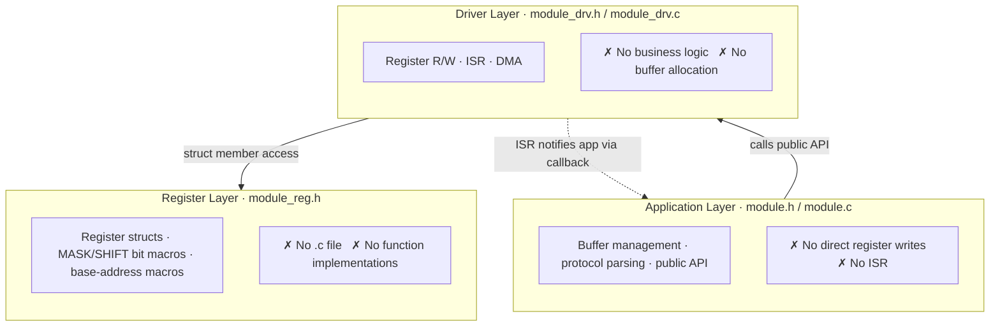

# embedded-code-skill

<p align="center">
  
  
  
  
  
  
  
</p>

<p align="center">
  <b>Embedded C coding-standard assistant for AI agents</b><br/>
  <i>Driver scaffolding · Legacy cleanup · Code review · Register refactoring</i>
</p>

<p align="center">
  <a href="README.md">简体中文</a> · <a href="README_EN.md">English</a> · <a href="README_JP.md">日本語</a>
</p>

---

## What It Is

A skill file for AI coding agents (Codex / Claude Code / Cursor). Once installed, your agent follows a conservative, reviewable, compilable coding standard when generating, reviewing, or refactoring embedded C bare-metal/driver code.

| Mode | What it does | Output |
|------|--------------|--------|
| 🔄 **REWRITE** | Clean up legacy drivers, preserve register write order and timing | Summary → gap list → patch |
| 🔍 **REVIEW** | Audit ISR / DMA / cache / race risks | P0 / P1 / P2 issue table |
| 📖 **GUIDE** | RTOS task design, CMake config, debug strategy | Conservative advice and snippets |

**It is not a chip manual**: register offsets, bit fields, IRQs, barriers, cache/DMA behavior, and timing must come from the datasheet, vendor headers, or your repository — the agent is not allowed to invent hardware facts. When information is missing, it marks `USER_PROVIDED` / `PLACEHOLDER` and lists the gaps first instead of guessing.

---

## Quick Start

```bash
# REWRITE: clean up a UART driver into three layers
/ecs Clean up this UART driver, preserve register write order

# REVIEW: audit DMA ISR risks
/ecs Review this DMA ISR for race or cache issues

# GUIDE: RTOS task design
/ecs Design FreeRTOS task priorities and stack sizes
```

Example REVIEW output:

| Severity | Location | Issue | Suggestion |
|----------|----------|-------|------------|
| P0 | `uart_drv.c:42` | Blocking call inside ISR | Use `...FromISR()` APIs |

> P0 = behavior/safety, P1 = concurrency/portability, P2 = style

---

## Core Design: Three-Layer Decoupling



Five files per peripheral: `module_reg.h` → `module_drv.h/.c` → `module.h/.c`. Flat projects skip the `module/` subdirectory and place all five files in the existing directory — the isolation standard is identical.

**Key rules at a glance**:

| Rule | In one sentence |
|------|-----------------|
| Register structs | Every peripheral register block becomes a `*_reg_t` struct; scattered address macros are banned |
| const pointer contract | Input pointers take `const`, output pointers don't — self-documenting APIs |
| Step comments | Key operations in driver/app function bodies get `/* Step N: ... */` annotations |
| Enum first | Related constant sets use `typedef enum`; independent values (masks, addresses) use macros |
| static by default | Internal functions and module-private variables are `static`; only public APIs are exported |
| No magic numbers | Every literal except `0`/`1` gets a named constant |
| Self-contained headers | Every file explicitly includes what it uses; no transitive-include reliance |

---

## RED LINES (P0 safety rules — never yield to project conventions)

1. No invented hardware parameters (registers / bit fields / IRQ / barriers / timing)
2. No reordering register writes or timing sequences (REWRITE must preserve them verbatim)
3. No ISR/main shared variables without `volatile`
4. No blocking calls inside ISRs (delay / malloc / mutex / printf)
5. No non-compilable output
6. No bare register addresses in business logic
7. No `malloc` / VLAs in the driver layer or ISRs

> Conflict resolution order: safety red lines → P1 concurrency & portability → P1 structural (yields to established project architecture) → P2 style (always yields to project conventions).

---

## Install

```bash
git clone https://github.com/leon-2050/embedded-code-skill.git
cd embedded-code-skill

./install.sh          # → ~/.codex/skills/embedded-code-skill/  (default)
./install.sh cursor   # → ~/.cursor/skills/embedded-code-skill/
./install.sh claude   # → ~/.claude/skills/embedded-code-skill/
```

Run from inside the repository, the script uses the local `SKILL.md` (works offline, version matches your checkout); it only downloads from the `main` branch when no local file exists. Manual install: copy `SKILL.md` into the platform's skills directory.

---

## Chapter Navigation (SKILL.md)

| Chapter | Coverage |
|---------|----------|
| §1 | Positioning, principles, work modes, RED LINES, priority arbitration |
| §2 | Fallback coding standards: naming / types & error handling / comments / includes / enums / static / magic numbers / macro safety |
| §3 | Register abstraction: `*_reg_t` struct template, layout rules, vendor/CMSIS reuse |
| §4 | Driver templates: three-layer five-file layout, interface templates, key structures |
| §5 | Architecture rules: Cortex-M / RISC-V / Xtensa barrier & interrupt quick ref, unknown-architecture handling |
| §6 | RTOS quick ref (FreeRTOS / Zephyr / RT-Thread) |
| §7 | Build system & linking: startup, compiler attributes, CMake |
| §8 | Memory, safety & concurrency defaults: malloc ban, volatile, DMA cache coherency |
| §9 | Review checklist (P0 → P1 → P2) and content admission |

~800 lines total. See [SKILL.md](SKILL.md) for the full specification.

---

## Maintenance

When modifying SKILL.md, follow the content admission rules (see SKILL.md §9.2):

- **Line budget**: 800 lines max; new rules must replace or merge existing entries — no pure additions
- **Single canonical example**: the canonical example lives in §3.2; everywhere else may only reference or replace it
- **One-way references**: the checklist references body sections; body text never references checklist item numbers

Smoke check after changes: REWRITE preserves public API / ABI / register write order; REVIEW flags race / volatile / barrier risks first; RTOS scenarios protect shared data and use ISR-safe APIs only; self-consistency — run SKILL.md's own example code through the P0–P2 checklist, it must pass. Compliance conclusions (DO-178C / IEC 61508 / ISO 26262) are written only when the user explicitly asks.

---

## License

[MIT](LICENSE) © 2025 [leon-2050](https://github.com/leon-2050)
