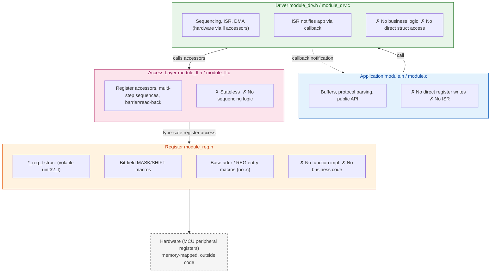

# embedded-code-skill

**Embedded C Code Assistant**: Helps AI produce conservative, reviewable code in embedded scenarios.

| Resource | Description |
| -------- | ----------- |
| [SKILL.md](SKILL.md) | Complete rule specification |

---

## What It Does

- **REWRITE**: Clean up legacy drivers, preserve register write order and timing; standardize naming and file organization per four-layer architecture
- **REVIEW**: Audit ISR/DMA/cache/race risks, output issue table prioritized by P0/P1/P2 severity
- **GUIDE**: RTOS task design, CMake config, debug strategy advisory (no REVIEW table required)

**Not a chip manual.** Register offsets, bit definitions, IRQs, barriers, cache/DMA, and timing must come from datasheets, vendor headers, or the repository — never fabricated.

---

## Core Principle: Four-Layer Decoupling



**File layout**: Seven files per peripheral — `module_reg.h` + `module_ll.h/.c` + `module_drv.h/.c` + `module.h/.c`.
Flat projects: place seven files directly in the current directory (no `module/` subdirectory). Projects using a `module/` subdirectory have the same layout, just nested one level deeper.

---

## Priority Arbitration

When rules conflict, apply from highest to lowest:

| Priority | Scope | Yield Rule |
| -------- | ----- | ---------- |
| P0 Safety Redlines | Fabricated hardware / write order / volatile / ISR blocking / compilability / bare registers / malloc | Never yields to project conventions |
| P1 Concurrency & Portability | Static multi-instance, type safety, error handling, macro safety | Never yields |
| P1 Structure | Four-layer split granularity, file organization | Yields when project has established architecture |
| P2 Style | Naming / comments / include order / file headers | Always yields to project conventions |

---

## RED LINES (P0 Safety — never yields to any project convention)

1. **No fabricated hardware facts** (registers/bit-fields/IRQs/barriers/timing/cache/DMA channels)
2. **No reordering** of register write sequences or timing sequences (REWRITE must preserve as-is)
3. **No missing `volatile`** on variables shared between ISR and main loop
4. **No blocking calls in ISR** (delay/malloc/mutex/printf; RTOS: ISR-safe APIs only)
5. **No non-compilable output** (consistent type names, macro names, signatures; correct syntax)
6. **No bare register addresses** in business logic (must access via register struct members)
7. **No `malloc`/VLA** in driver layer or ISR

---

## Quick Start

```bash
# REWRITE: Clean up UART driver into four layers
/embedded-code-skill Clean up this UART driver into four layers

# REVIEW: Audit DMA ISR risks
/embedded-code-skill Review this DMA ISR for race or cache issues

# GUIDE: RTOS task design
/embedded-code-skill Design FreeRTOS task priorities and stack sizes
```

---

## Install

```bash
./install.sh          # ~/.claude/skills/embedded-code-skill/
```

---

## Chapter Navigation

| Chapter | Coverage |
| ------- | -------- |
| §1 | Positioning, principles, work modes, RED LINES |
| §2 | Fallback coding standards (naming, types, error handling, data structures, comments, enums, static, macro safety) |
| §3 | Register abstraction (hierarchical structs, MASK/SHIFT, vendor struct reuse) |
| §4 | Driver templates (four-layer seven-file, flat layout, interface specs, key structures) |
| §5 | Architecture rules (Cortex-M RISC-V barriers/interrupts/DMA cache coherency) |
| §6 | RTOS guidance (FreeRTOS/Zephyr/RT-Thread ISR rules, deadlock prevention) |
| §7 | Build system (linker scripts, startup, CMake templates) |
| §8 | Memory, safety & concurrency (malloc ban, volatile, DMA cache, critical sections) |
| §9 | Review checklist & maintenance self-check (P0→P1→P2 cascade) |

See [SKILL.md](SKILL.md) for full specifications.

---

## License

MIT License
