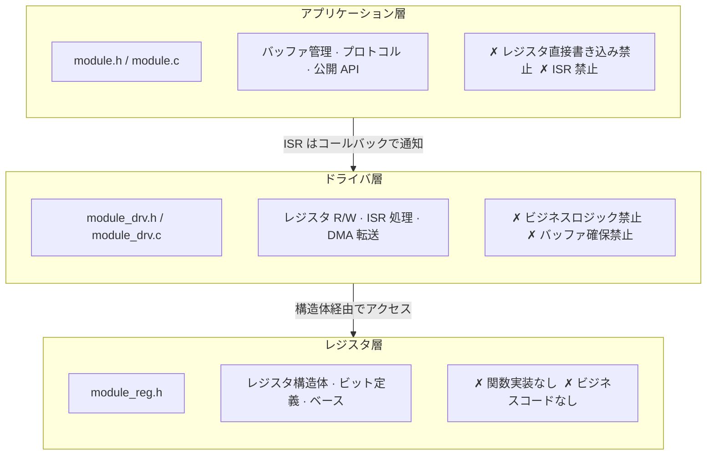

# embedded-code-skill

**Embedded C コードアシスタント**: 組み込みシナリオで AI が保守的でレビュー可能なコードを出力することを支援します。

| リソース | 説明 |
|----------|------|
| [SKILL.md](SKILL.md) | 唯一のルールエントリーポイント |
| [install.sh](install.sh) | インストールスクリプト |

---

## 何をするか

- **REWRITE**: レガシードライバを整理、レジスタ書き込み順序とタイミングを保持
- **REVIEW**: ISR/DMA/cache/競合リスクを監査、問題表を出力
- **GUIDE**: RTOS タスク設計、CMake 設定、デバッグ戦略のコンサルティング

**チップマニュアルではありません**。レジスタマップ、IRQ テーブル、認証資料の代替ではありません。

---

## コア原則：三層分離

REWRITE/REVIEW は三層アーキテクチャに従う必要があります：



五ファイル構成：`module_reg.h` → `module_drv.h/.c` → `module.h/.c`

---

## クイックスタート

```bash
# REWRITE: UART ドライバを整理、レジスタ書き込み順序を保持
/embedded-code-skill この UART ドライバを三層に整理する

# REVIEW: DMA ISR リスクを監査
/embedded-code-skill この DMA ISR の競合やキャッシュ問題を監査する

# GUIDE: RTOS タスク設計
/embedded-code-skill FreeRTOS タスク優先度とスタックサイズを設計する
```

---

## RED LINES（禁止事項）

1. ハードウェア事実の捏造禁止（レジスタ/IRQ/バリア/タイミング）
2. 低レベルコードでの `malloc` / VLA 禁止
3. 公共インターフェースでの `int`/`char`/`long` をデフォルト型として使用禁止
4. ビジネスロジックへの裸レジスタアドレス散布禁止
5. コンパイル不可能な出力の禁止
6. **三層分離の違反禁止**

---

## インストール

```bash
./install.sh          # ~/.codex/skills/embedded-code-skill/
./install.sh cursor   # ~/.cursor/skills/embedded-code-skill/
./install.sh claude   # ~/.claude/skills/embedded-code-skill/
```

---

## 章ナビゲーション

| 章 | 内容 |
|----|------|
| §1 | 定位、使用原則、作業モード、RED LINES |
| §2 | コーディング規範（命名、型、エラー処理、データ構造、コメント） |
| §3 | レジスタ抽象化（階層的構造体、`MASK/SHIFT`） |
| §4 | ドライバテンプレート（三層五ファイル、インターフェース仕様） |
| §5 | アーキテクチャ規則（Cortex-M/A、ESP32、RISC-V 等） |
| §6 | RTOS ガイダンス（FreeRTOS/Zephyr/RT-Thread） |
| §7 | ビルドシステム（リンカスクリプト、CMake） |
| §8 | メモリ、安全性、並行性のデフォルト |
| §9 | レビューチェックリストとメンテナンス自己チェック |

詳細は [SKILL.md](SKILL.md) を参照してください。

---

## ライセンス

MIT License
