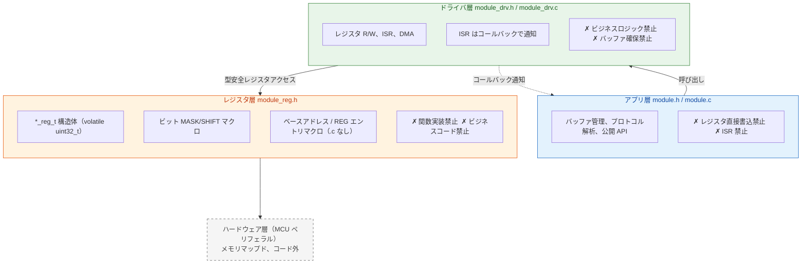

# embedded-code-skill

**Embedded C コードアシスタント**: 組み込みシナリオで AI が保守的でレビュー可能なコードを出力することを支援します。

| リソース | 説明 |
| -------- | ---- |
| [SKILL.md](SKILL.md) | 完全なルール仕様 |

---

## 何をするか

- **REWRITE**: レガシードライバを整理、レジスタ書き込み順序とタイミングを保持、三層アーキテクチャに準拠した命名とファイル構成に標準化
- **REVIEW**: ISR/DMA/cache/競合リスクを監査、P0/P1/P2 優先度で問題表を出力
- **GUIDE**: RTOS タスク設計、CMake 設定、デバッグ戦略のコンサルティング（REVIEW 表は不要）

**チップマニュアルではありません**。レジスタオフセット、ビット定義、IRQ、バリア、cache/DMA、タイミングはデータシート、ベンダヘッダ、またはリポジトリから入手する必要があり、決して捏造してはいけません。

---

## コア原則：三層分離



**ファイル構成**: ペリフェラル毎に五ファイル — `module_reg.h` + `module_drv.h/.c` + `module.h/.c`。
フラットプロジェクト: 五ファイルをカレントディレクトリに直接配置（`module/` サブディレクトリ不要）。`module/` ディレクトリ使用時も同じ五ファイル構成、ネストが一段深くなるのみ。

---

## 優先順位

ルールが競合する場合、高いものから順に適用：

| 優先度 | 範囲 | 譲歩ルール |
| ------ | ---- | ---------- |
| P0 安全レッドライン | ハードウェア捏造/書き込み順序/volatile/ISR ブロッキング/コンパイル可能性/ベアレジスタ/malloc | いかなるプロジェクト規約にも譲らない |
| P1 並行性と移植性 | static マルチインスタンス、型安全性、エラー処理、マクロ安全性 | 譲らない |
| P1 構造 | 三層分割粒度、ファイル構成 | プロジェクトに既存アーキテクチャがある場合は譲る |
| P2 スタイル | 命名/コメント/include 順序/ファイルヘッダ | 常にプロジェクト規約に譲る |

---

## RED LINES（P0 安全 — いかなるプロジェクト規約にも譲りません）

1. **ハードウェア事実の捏造禁止**（レジスタ/ビットフィールド/IRQ/バリア/タイミング/cache/DMA チャネル）
2. **レジスタ書き込み順序の変更禁止**（REWRITE は現状を保持）
3. **ISR とメインループ間で共有する変数に `volatile` がない場合の禁止**
4. **ISR 内でのブロッキング呼び出し禁止**（delay/malloc/mutex/printf；RTOS では ISR 安全 API のみ）
5. **コンパイル不可能な出力の禁止**（一貫した型名/マクロ名/シグネチャ、正しい構文）
6. **ビジネスロジックでのベアレジスタアドレス禁止**（レジスタ構造体メンバ経由でアクセス必須）
7. **ドライバ層/ISR での `malloc`/VLA 禁止**

---

## Quick Start

```bash
# REWRITE: UART ドライバを三層に整理
/embedded-code-skill この UART ドライバを三層に整理する

# REVIEW: DMA ISR リスクを監査
/embedded-code-skill この DMA ISR の競合やキャッシュ問題を監査する

# GUIDE: RTOS タスク設計
/embedded-code-skill FreeRTOS タスク優先度とスタックサイズを設計する
```

---

## インストール

```bash
./install.sh          # ~/.claude/skills/embedded-code-skill/
```

---

## 章ナビゲーション

| 章 | 内容 |
| -- | ---- |
| §1 | 定位、使用原則、作業モード、RED LINES |
| §2 | Fallback コーディング規範（命名、型、エラー処理、データ構造、コメント、enum、static、マクロ安全性） |
| §3 | レジスタ抽象化（階層的構造体、MASK/SHIFT、ベンダ構造体再利用） |
| §4 | ドライバテンプレート（三層五ファイル、フラットレイアウト、インターフェース仕様、主要構造） |
| §5 | アーキテクチャ規則（Cortex-M RISC-V バリア/割り込み/DMA cache コヒーレンシー） |
| §6 | RTOS ガイダンス（FreeRTOS/Zephyr/RT-Thread ISR ルール、デッドロック予防） |
| §7 | ビルドシステム（リンカスクリプト、スタートアップ、CMake テンプレート） |
| §8 | メモリ、安全性と並行性（malloc 禁止、volatile、DMA cache、クリティカルセクション） |
| §9 | レビューチェックリストとメンテナンス自己チェック（P0→P1→P2 カスケード） |

詳細は [SKILL.md](SKILL.md) を参照してください。

---

## ライセンス

MIT License
