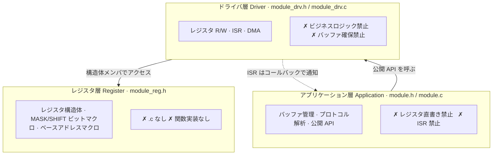

# embedded-code-skill

<p align="center">
  
  
  
  
  
  
  
</p>

<p align="center">
  <b>AI コーディングエージェント向け組み込み C 規約アシスタント</b><br/>
  <i>ドライバ骨格生成 · レガシー整理 · コードレビュー · レジスタリファクタリング</i>
</p>

<p align="center">
  <a href="README.md">简体中文</a> · <a href="README_EN.md">English</a> · <a href="README_JP.md">日本語</a>
</p>

---

## これは何

AI コーディングエージェント（Codex / Claude Code / Cursor）向けのスキルファイルです。インストールすると、エージェントが組み込み C のベアメタル/ドライバコードを生成・レビュー・リファクタリングする際に、保守的でレビュー可能・コンパイル可能なコーディング規約に従うようになります。

| モード | 内容 | 出力 |
|--------|------|------|
| 🔄 **REWRITE** | レガシードライバを整理、レジスタ書き込み順序とタイミングを保持 | 要約 → ギャップリスト → patch |
| 🔍 **REVIEW** | ISR / DMA / cache / 競合リスクを監査 | P0 / P1 / P2 問題表 |
| 📖 **GUIDE** | RTOS タスク設計、CMake 設定、デバッグ戦略 | 保守的な提案とコード例 |

**チップマニュアルではありません**：レジスタオフセット、ビットフィールド、IRQ、バリア、cache/DMA、タイミングは必ずデータシート・ベンダーヘッダ・あなたのリポジトリに基づきます。エージェントはハードウェア事実を捏造できません。情報が足りない場合は推測せず、`USER_PROVIDED` / `PLACEHOLDER` を付記してギャップを先に列挙します。

---

## クイックスタート

```bash
# REWRITE：UART ドライバを三層に整理、書き込み順序を保持
/ecs この UART ドライバを三層アーキテクチャに整理して

# REVIEW：DMA ISR のリスクを監査
/ecs この DMA ISR の競合やキャッシュ問題を監査して

# GUIDE：RTOS タスク設計
/ecs FreeRTOS のタスク優先度とスタックサイズを設計して
```

REVIEW モードの出力例：

| 重要度 | 位置 | 問題 | 提案 |
|--------|------|------|------|
| P0 | `uart_drv.c:42` | ISR 内でブロッキング呼び出し | `...FromISR()` 系 API に変更 |

> P0 = 動作/安全上のリスク、P1 = 並行性/移植性の問題、P2 = スタイル提案

---

## コア設計：三層分離



ペリフェラルごとに 5 ファイル：`module_reg.h` → `module_drv.h/.c` → `module.h/.c`。フラットなプロジェクトでは `module/` サブディレクトリを作らず、5 ファイルを既存ディレクトリに直接配置します。分離基準は同じです。

**主要ルール一覧**：

| ルール | 一言で |
|--------|--------|
| レジスタ構造体化 | ペリフェラルのレジスタブロックは必ず `*_reg_t` 構造体で定義。アドレスマクロの乱立は禁止 |
| const ポインタ契約 | 入力ポインタには `const`、出力には付けない——自己文書化 API |
| Step 番号コメント | ドライバ/アプリ関数内の重要操作に `/* Step N: ... */` を付記 |
| 列挙型優先 | 関連する定数群は `typedef enum`。独立した値（マスク・アドレス）はマクロ |
| デフォルト static | 内部関数とモジュール私有変数は `static`。公開 API のみ外部公開 |
| マジックナンバー禁止 | `0`/`1` 以外のリテラルは必ず名前付き定数に |
| 自己完結ヘッダ | 各ファイルは使用シンボルを明示的に include。推移的インクルードに依存しない |

---

## RED LINES（P0 安全ルール——プロジェクト慣習に一切譲らない）

1. ハードウェアパラメータの捏造禁止（レジスタ / ビットフィールド / IRQ / バリア / タイミング）
2. レジスタ書き込み順序・タイミングシーケンスの変更禁止（REWRITE ではそのまま保持）
3. ISR/メインループ共有変数の `volatile` 欠落禁止
4. ISR 内ブロッキング呼び出し禁止（delay / malloc / mutex / printf）
5. コンパイル不可能な出力の禁止
6. ビジネスコードへの裸レジスタアドレス禁止
7. ドライバ層 / ISR での `malloc` / VLA 禁止

> 競合時の優先順位：安全 RED LINES → P1 並行性・移植性 → P1 構造類（既存アーキテクチャがあれば譲る）→ P2 スタイル類（常にプロジェクト慣習に従う）。

---

## インストール

```bash
git clone https://github.com/leon-2050/embedded-code-skill.git
cd embedded-code-skill

./install.sh          # → ~/.codex/skills/embedded-code-skill/  （デフォルト）
./install.sh cursor   # → ~/.cursor/skills/embedded-code-skill/
./install.sh claude   # → ~/.claude/skills/embedded-code-skill/
```

リポジトリ内で実行すると、スクリプトはローカルの `SKILL.md` を使用します（オフライン可、チェックアウトと同一バージョン）。ローカルファイルがない場合のみ `main` ブランチからダウンロードします。手動インストール：`SKILL.md` を各プラットフォームの skills ディレクトリにコピーするだけです。

---

## 章ナビゲーション（SKILL.md）

| 章 | 内容 |
|----|------|
| §1 | 定位・使用原則・作業モード・RED LINES・優先度仲裁 |
| §2 | フォールバック規約：命名 / 型とエラー処理 / コメント / include / 列挙型 / static / マジックナンバー / マクロ安全性 |
| §3 | レジスタ抽象化：`*_reg_t` 構造体テンプレート・レイアウト規則・vendor/CMSIS 再利用 |
| §4 | ドライバテンプレート：三層五ファイル・インターフェース・主要構造 |
| §5 | アーキテクチャ規則：Cortex-M / RISC-V / Xtensa バリア・割り込み早見表・未知アーキテクチャの扱い |
| §6 | RTOS 早見表（FreeRTOS / Zephyr / RT-Thread） |
| §7 | ビルドシステムとリンク：startup・コンパイラ属性・CMake |
| §8 | メモリ・安全・並行性のデフォルト：malloc 禁止・volatile・DMA cache 一貫性 |
| §9 | 回査チェックリスト（P0 → P1 → P2）とコンテンツ准入 |

全文約 800 行。詳細は [SKILL.md](SKILL.md) を参照してください。

---

## メンテナンス

SKILL.md を変更する際は、コンテンツ准入ルール（SKILL.md §9.2）に従ってください：

- **行数予算**：800 行以内。新ルールは既存項目の置き換え・統合必須。純粋な追加は禁止
- **例は一つ**：canonical 例は §3.2 に集約。他の場所では参照・置き換えのみ
- **一方向参照**：チェックリスト → 本文セクション番号。本文からチェックリスト項目番号への参照は禁止

変更後の smoke check：REWRITE が公開 API / ABI / レジスタ書き込み順序を保持すること。REVIEW が race / volatile / barrier リスクを優先報告すること。RTOS シナリオで共有データが保護され ISR が ISR 安全 API のみ使うこと。自己整合性——SKILL.md 自身のサンプルコードを P0–P2 チェックリストに通し、すべて合格すること。DO-178C / IEC 61508 / ISO 26262 等の適合性結論は、ユーザーが明示的に求めた場合のみ記述します。

---

## ライセンス

[MIT](LICENSE) © 2025 [leon-2050](https://github.com/leon-2050)
